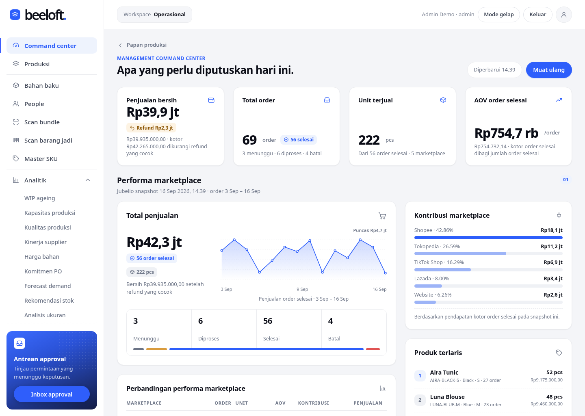

# Beeloft One

Workspace operasional internal Beeloft. Satu aplikasi dan satu database lokal menyatukan performa
marketplace, produksi, pembelian, bahan baku, gudang, kualitas, people, visibilitas keuangan,
approval, serta analitik dan AI. Versi aplikasi 0.97.0, schema database 55.

[](https://github.com/wenn-id/beeloftone/actions/workflows/ci.yml)



> Tangkapan layar Command Center pada database contoh. **Seluruh angka pada gambar adalah data
> demonstrasi sintetis (DEMO/CONTOH), bukan angka penjualan Beeloft yang sebenarnya.** Varian lain
> tersedia di [`docs/screenshots/`](docs/screenshots): `command-center-desktop.png`,
> `command-center-mobile.png`, dan `command-center-200-text.png`.

## Apa yang dikerjakan Beeloft One

- **Performa marketplace.** Penjualan bersih, order, unit, AOV order selesai, tren harian,
  kontribusi per marketplace, produk terlaris, dan cakupan retur dari snapshot Jubelio.
- **Produksi.** Order produksi multi-SKU, saldo pcs per tahap, kendala, perubahan tenggat/PIC,
  WIP ageing, dan perencanaan kapasitas work center berbasis menit.
- **Pembelian.** Permintaan pembelian, pemasok, penerbitan PO dengan approval, penerimaan,
  retur supplier, penutupan PO, kinerja supplier, harga bahan, dan komitmen PO terbuka.
- **Bahan baku.** Master bahan, batch dengan label QR, BOM per SKU, reservasi per order, pemakaian
  aktual, dan waste cutting.
- **Gudang dan inventori.** Penerimaan barang jadi, transfer lokasi, keputusan hold, reservasi
  marketplace, picking dengan verifikasi scan, packing, shipping, retur pelanggan, adjustment,
  stock opname, dan rekonsiliasi.
- **Kualitas.** QC bahan masuk, final QC dengan temuan pengukuran/visual, tren yield dan defect per
  line atau vendor, serta alert kualitas di Command Center.
- **People.** Employee master, kehadiran, cuti, absen, lembur, approval cuti/lembur, dan alert
  kehadiran di Command Center.
- **Visibilitas keuangan.** Biaya produksi aktual per order, margin kontribusi, ringkasan keuangan,
  utang usaha, piutang usaha, payroll agregat, serta rekonsiliasi pembayaran dan akuntansi payroll
  dari snapshot Mekari.
- **Approval.** Satu inbox untuk permintaan pembelian, perubahan produksi, penerbitan PO,
  pembayaran supplier, budget marketing, cuti/lembur, batch payroll, dan tindakan AI.
- **Analitik dan AI.** Forecast demand, risiko stockout, rekomendasi produksi dan pembelian,
  analisis retur/ukuran/dead stock/adjustment, investigasi bisnis berbahasa Indonesia, serta
  proposal tindakan AI yang tetap memerlukan approval manusia.
- **Traceability.** Label dan scan QR untuk batch bahan, bundle, dan barang jadi; jejak stok per lot
  dan jejak produksi per batch bahan; global audit trail lintas modul.

## Arsitektur dan model source of truth

| Sistem | Menjadi sumber untuk | Perlakuan di Beeloft One |
|---|---|---|
| **Jubelio** | Commerce marketplace: order dan penjualan, stok jual/fulfillment, retur marketplace, listing | Dikonsumsi read-only sebagai snapshot; tidak pernah ditulis balik |
| **Mekari** | Keuangan dan payroll: ringkasan keuangan, utang usaha, piutang usaha, payroll agregat | Dikonsumsi read-only sebagai snapshot; tidak pernah ditulis balik |
| **Beeloft One** | Sistem operasional produksi dan business rule: master SKU, order produksi, WIP, bahan, PO, gudang, QC, people, approval | Ledger internal yang menjadi sumber kebenaran dan pemilik aturan bisnis |

Batas ini dijaga secara eksplisit:

- Beeloft One tidak mengirim data, uang, atau perintah ke Jubelio maupun Mekari.
- Angka vendor bersifat *snapshot-scoped*: selalu ditampilkan bersama waktu snapshot dan rentang
  tanggal yang benar-benar diturunkan dari datanya, bukan diberi label "hari ini" atau "bulan ini".
- Scope yang belum pernah menerima data ditandai **belum tersedia** dan masuk antrean perhatian.
  Aplikasi tidak menampilkannya sebagai nol yang terlihat seolah sudah terverifikasi.
- Layar analitik hanya memvisualkan field yang benar-benar ada pada sumbernya. Tidak ada metrik,
  target, atau delta yang dikarang.

Alur pcs internal, terpisah dari stok jual Jubelio:

```text
planned -> cutting -> sewing -> finishing -> qc -> warehouse
                                            | -> reject
                                            | -> rework -> selesai rework -> qc -> inspeksi ulang
```

Pengembalian `rework -> qc` selalu berupa catatan **selesai rework** yang menyebut catatan final QC
penghasil rework tersebut, sehingga hasilnya dapat diinspeksi ulang secara sah, berulang kali, tanpa
kehilangan jejak. First-pass yield tetap dihitung dari inspeksi awal saja.

Teknologi: Python 3.12 dengan FastAPI/Starlette/uvicorn, SQLite (WAL) sebagai penyimpanan, dan
frontend ES module tanpa build step, tanpa framework, serta tanpa dependency runtime pihak ketiga.
Server default hanya mendengarkan localhost.

## Modul utama

| Modul | Isi |
|---|---|
| Command center | Performa marketplace Jubelio, antrean keputusan, snapshot produksi/kualitas/kapasitas/people/inventori/keuangan/integrasi, read-only untuk semua role |
| Produksi | Papan order, saldo per tahap, perpindahan dan pembalikan, kendala, cutting, bundle, sewing/makloon, finishing, final QC, selesai rework dan inspeksi ulang |
| Bahan baku | Master bahan, batch, BOM, reservasi, pemakaian aktual, waste |
| People | Roster harian, kehadiran, permintaan cuti/lembur, employee master |
| Scan bundle / Scan barang jadi | Entry QR untuk membuka aksi dan memverifikasi pergerakan fisik |
| Master SKU | Master produk per kombinasi warna/ukuran dan mapping SKU ke Jubelio |
| Analitik | WIP ageing, kapasitas produksi, kualitas produksi, kinerja supplier, harga bahan, komitmen PO, forecast demand, rekomendasi stok, analisis ukuran, analisis retur, dead stock, audit adjustment |
| Tanya Beeloft | Investigasi bisnis berbahasa Indonesia, riwayat investigasi, feedback, dan proposal tindakan AI |
| Integrasi | Kesehatan sinkronisasi, snapshot Jubelio/Mekari, rekonsiliasi stok, pembayaran dan akuntansi payroll |
| Approval | Inbox gabungan permintaan pembelian, perubahan produksi, PO, pembayaran supplier, budget marketing, cuti/lembur, batch payroll |
| Laporan aktivitas, audit trail, cadangan data | Aktivitas harian dengan ekspor CSV, audit trail lintas modul untuk admin, dan backup database |

## Quick start

Windows, PowerShell, di folder proyek:

```powershell
.\start.ps1 -Demo
```

Script memasang dependencies ke `.venv`, membuat `data/demo.sqlite3` bila belum ada, menampilkan API
key admin/operator/viewer sekali di terminal, lalu menjalankan server lokal. Buka
<http://127.0.0.1:8000/>, masukkan API key pada kolom **Kunci akses**, dan buka order dari daftar.
Jalankan tanpa `-Demo` untuk database kosong. Hentikan dengan Ctrl+C.

Tanpa script:

```powershell
python -m venv .venv
.\.venv\Scripts\python.exe -m pip install -r requirements.txt
.\.venv\Scripts\python.exe -m pip install --no-deps -e .
.\.venv\Scripts\python.exe -m beeloft user --name "Pemilik" --role admin
.\.venv\Scripts\python.exe -m beeloft serve
```

Dibutuhkan Python 3.12+. Database default `data/beeloft.sqlite3`, dapat diubah dengan `--db PATH`
atau environment variable `BEELOFT_DB`. Dokumentasi API interaktif tersedia di `/docs`.

Manual lengkap — pemakaian dashboard, kontrak API, pembuatan akun, backup dan pemulihan — ada di
[panduan operasional](docs/operations.md).

## Pengujian dan CI

Lokal:

```powershell
.\.venv\Scripts\python.exe -m unittest discover -s tests -v
.\.venv\Scripts\python.exe -m pip check
.\.venv\Scripts\python.exe scripts\regenerate_openapi.py
node tests/test_client.mjs
python tests/run_browser.py --node PATH_NODE --playwright-module PATH_MODUL_PLAYWRIGHT
```

`scripts\regenerate_openapi.py` menulis ulang `docs/openapi.json` dari runtime yang
terinstal. Jalankan setiap kali versi naik atau endpoint berubah; `tests/test_openapi_contract.py`
gagal bila kontrak tertinggal, dan `tests/test_readme_test_count.py` gagal bila jumlah
test di README tidak lagi cocok dengan discovery.

Suite Python berisi 574 test yang memakai database sementara serta API/CLI sungguhan; mencakup
konservasi jumlah, transfer bersamaan, retry ganda, rollback kegagalan penyimpanan, izin per role,
input tidak sah, guard bisnis, pembalikan, migrasi, dan backup. Tidak ada data bisnis nyata di dalam
test. Runner browser membuat database dan server sementara, menjalankan seluruh modul acceptance
melalui browser sungguhan, lalu menghentikan server dan membersihkan data. Playwright adalah alat QA,
bukan dependency aplikasi; default channel lokal `msedge`, gunakan `--channel chrome` untuk Chrome.

[GitHub Actions](.github/workflows/ci.yml) berjalan pada pull request ke `main` dan push ke `main`,
di Ubuntu, dengan dua job berurutan:

| Job | Isi |
|---|---|
| `core` | Python 3.12 dan Node.js 22: instalasi dependencies, `unittest discover`, `pip check`, `compileall` paket `beeloft`, `node --check` untuk `app.mjs` dan `client.mjs`, serta `tests/test_client.mjs` |
| `browser` | Berjalan setelah `core` lulus: instalasi aplikasi yang sama, Playwright versi terpin, Chromium beserta dependency sistem Linux, lalu `tests/run_browser.py` dengan `--channel chromium` |

## Integrasi

Layar **Integrasi** menampilkan peta source of truth, kesehatan setiap scope sinkronisasi
(**Belum pernah sinkron**, **Sehat**, **Terlambat**, **Gagal**), jumlah record dibaca/ditulis/ditolak,
cursor sumber, pelaku, dan error terakhir. Snapshot Jubelio dan Mekari dikirim oleh admin melalui
endpoint ingestion, dicatat atomik dan immutable, dan otomatis membentuk run sinkronisasi. Record yang
identifiernya tidak cocok dengan mapping aktif masuk karantina dan tidak ikut dihitung.

**Batas integrasi saat ini:** Beeloft One mengonsumsi data Jubelio dan Mekari melalui endpoint
ingestion snapshot. **Connector worker langsung ke API vendor dan sinkronisasi terjadwal belum
diimplementasikan.** Aplikasi belum menyimpan credential vendor, belum memanggil API Jubelio/Mekari,
dan belum menjalankan scheduler. Karena itu tidak ada sinkronisasi real-time: seluruh angka vendor
adalah snapshot pada waktu tertentu, dan kesegarannya bergantung pada kapan snapshot terakhir dikirim.

## Integritas data dan keamanan

- **Ledger append-only.** Transaksi bisnis dan keputusan approval tidak diedit atau dihapus. Koreksi
  dicatat sebagai event baru yang menunjuk transaksi asal, lengkap dengan alasan dan pelaku.
- **Idempotency.** Setiap POST `/api/*` wajib membawa `Idempotency-Key`. Satu key mengikat satu
  transaksi logis pada seluruh database dan hanya boleh diselesaikan oleh akun pencatat aslinya.
  Retry dengan key dan payload yang sama mengembalikan respons pertama tanpa pencatatan ganda; key
  sama dengan payload berbeda ditolak 409; key milik akun lain ditolak 403 tanpa mutasi.
- **Binding aktor.** Setiap pencatatan dari dashboard menyatakan akun yang menyusunnya. Server
  menolak 403 sebelum mutasi dijalankan bila session browser ternyata sudah berpindah ke akun lain,
  sehingga form yang dibuka satu akun tidak dapat menghasilkan catatan milik akun lain.
- **Revision guard.** Perubahan data bersaldo memakai revisi yang diharapkan, sehingga dua pengguna
  tidak saling menimpa secara diam-diam.
- **Guard bisnis di database.** Konservasi jumlah, saldo tahap, alokasi bundle, stok reserved,
  kecocokan scan terhadap receipt, dan penutupan PO dijaga dalam satu transaksi.
- **Role.** `admin`, `operator`, dan `viewer`. Command center dan layar analitik read-only untuk semua
  role aktif; hak mencatat dan memutuskan tetap diperiksa oleh endpoint domain.
- **Autentikasi.** API key hanya disimpan sebagai hash dan tidak dapat ditampilkan kembali. Dashboard
  menukar key dengan session browser delapan jam: cookie `HttpOnly` `SameSite=Strict`, cookie CSRF
  untuk request yang mengubah data, dan atribut `Secure` saat dilayani melalui HTTPS. Login OIDC/SSO
  tersedia bila konfigurasi provider lengkap.
- **Audit trail.** Global audit trail menyimpan operasi, objek, referensi, pelaku, waktu, dan alasan
  untuk perubahan bisnis manual, impor snapshot, dan keputusan approval.
- **Penanganan data sensitif.** Snapshot payroll disimpan agregat per periode tanpa identitas atau
  gaji per karyawan, dan tanpa data rekening. Nilai uang dibandingkan sebagai exact decimal.
- **Backup.** `python -m beeloft backup` memakai SQLite backup API sehingga konsisten meski server
  berjalan, dan tidak menimpa file tujuan. Backup memuat hash API key, jadi simpan dengan akses
  terbatas.
- **Data contoh.** Seluruh data demo diberi nama DEMO/CONTOH agar tidak tertukar dengan data nyata.

## Dokumentasi

- [Register proses bisnis F01](docs/f01-process-register.md) dan
  [keputusan, bukti, serta gerbang sign-off](docs/f01-decisions-evidence.md) untuk
  roadmap penggantian backoffice #40. Status discovery; belum business accepted.
- [Kontrak transaksi dan data bersama F02](docs/f02-shared-contracts.md), dengan
  fixture sintetis dan inventaris pemilik tabel/endpoint untuk #41. Draft persiapan;
  penerimaan kontrak menunggu keputusan F01 dan sign-off A1/A2/A3 serta A0/pemilik bisnis.
- [Handoff audit teknis F03](docs/f03-technical-audit.md) — status #26–#37,
  commit perbaikan, regresi scope AI, bukti uji dan batas penerimaan #42.
- [Kesiapan master produk, bahan dan satuan M01](docs/m01-master-readiness.md)
  untuk #43: gap terhadap HEAD dan bukti baseline; implementasi menunggu penerimaan F02.
- [Kesiapan unit usaha, lokasi, pihak dan employee M02](docs/m02-master-readiness.md)
  untuk #44: pemetaan gap identitas dan migrasi; implementasi menunggu penerimaan F02.
- [Kesiapan izin per fungsi O01](docs/o01-permission-readiness.md) untuk #45:
  akses baseline, jalur data sensitif dan kebutuhan keputusan F02/M02/D17.
- [Kesiapan ledger keuangan A01](docs/a01-ledger-readiness.md) untuk #46:
  sumber transaksi, batas snapshot/posting native dan keputusan accounting yang diperlukan.
- [Drill pemulihan dan runbook O02](docs/o02-recovery-readiness.md) untuk #47:
  restore lokal terisolasi, batas bukti dan kebutuhan deployment/RPO/RTO.
- [Kesiapan template bahan/jasa dan tarif P01](docs/p01-template-rate-readiness.md)
  untuk #48: batas BOM/biaya/kapasitas dan skenario tarif; menunggu M01/M02 serta keputusan D04.
- [Panduan operasional](docs/operations.md) — pemakaian dashboard, kontrak API, akun, backup, pengujian.
- [Riwayat versi v0.3–v0.85](docs/version-history.md) — riwayat implementasi per milestone beserta
  riwayat migrasi schema.
- [Desain produk dan modul](docs/design.md) — keputusan desain domain.
- [Spesifikasi antarmuka](DESIGN.md) — sistem visual, grid, tipografi, dan aturan Command Center.
- [Rencana implementasi](docs/implementation-plan.md) — status dan urutan pengerjaan.
- [Kontrak OpenAPI](docs/openapi.json) — juga tersedia dari server berjalan di `/openapi.json`.
  Regenerasi dengan `python scripts/regenerate_openapi.py` setiap kali endpoint atau versi
  berubah; `tests/test_openapi_contract.py` memblokir kontrak tertinggal dari runtime.
- [Tangkapan layar](docs/screenshots) — Command Center desktop, mobile, dan zoom teks 200%.
- Rencana dan bukti pengujian per milestone tersimpan sebagai `docs/*-plan.md` dan
  `docs/*-verification.md`, dan ditautkan dari riwayat versi.

## Batas saat ini dan arah selanjutnya

- Server hanya mendengarkan localhost. Rilis ini untuk pengembangan dan uji lokal, belum deployment
  bersama untuk tim.
- Connector worker Jubelio/Mekari dan sinkronisasi terjadwal belum ada; data vendor masuk lewat
  ingestion snapshot.
- Belum ada pembaruan otomatis antar perangkat pada dashboard; muat ulang untuk mengambil data terbaru.
- Belum mencakup partial cancellation, perubahan jumlah target setelah order dibuat, dan attachment
  pada kendala.
- Feedback investigasi AI belum melatih model atau mengubah aturan rekomendasi secara otomatis.
- Parameter agregasi replenishment di Command Center masih default operasional dan belum dapat diubah
  dari layar tersebut.
- Sebelum dipakai banyak perangkat: siapkan HTTPS, penyedia identitas/SSO, kebijakan akses yang lebih
  rinci, backup terjadwal dengan uji restore, dan validasi alur di lapangan.
- SQLite cukup untuk uji lokal. Evaluasi PostgreSQL saat perlu beberapa instance aplikasi atau
  penulisan bersamaan yang lebih tinggi.
- Buat backup dengan versi aplikasi lama sebelum upgrade; setiap migrasi berjalan dalam satu transaksi
  tanpa mengubah catatan produksi lama.
