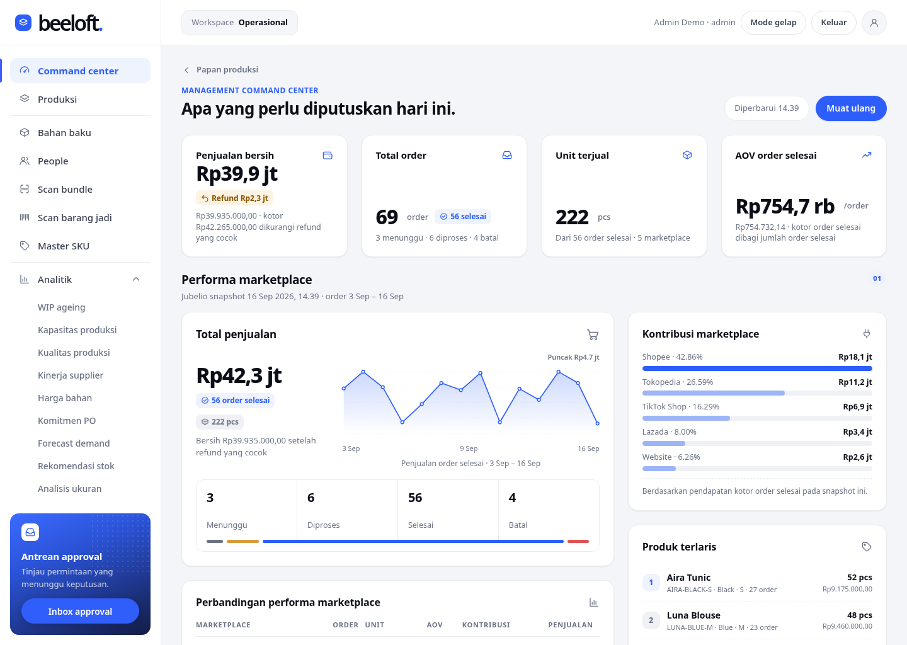

# Beeloft One

Workspace operasional internal Beeloft. Satu aplikasi dan satu database lokal menyatukan performa
marketplace, produksi, pembelian, bahan baku, gudang, kualitas, people, visibilitas keuangan,
approval, serta analitik dan AI. Versi aplikasi 0.121.0, schema database 63.

[](https://github.com/wenn-id/beeloftone/actions/workflows/ci.yml)



> Tangkapan layar Command Center pada database contoh. **Seluruh angka pada gambar adalah data
> demonstrasi sintetis (DEMO/CONTOH), bukan angka penjualan Beeloft yang sebenarnya.** Varian lain
> tersedia di [`docs/screenshots/`](docs/screenshots): `command-center-desktop.png`,
> `command-center-mobile.png`, dan `command-center-200-text.png`.

## Apa yang dikerjakan Beeloft One

- **Performa marketplace.** Penjualan bersih, order, unit, AOV order selesai, tren harian,
  kontribusi per marketplace, produk terlaris, dan cakupan retur dari snapshot Jubelio.
- **Produksi.** Order produksi multi-SKU, saldo pcs per tahap, kendala, perubahan tenggat/PIC,
  WIP ageing, dan perencanaan kapasitas work center berbasis menit.
- **Pembelian.** Permintaan pembelian, pemasok, penerbitan PO dengan approval, penerimaan,
  retur supplier, penutupan PO, kinerja supplier, harga bahan, dan komitmen PO terbuka.
- **Bahan baku.** Master bahan, batch dengan label QR, BOM per SKU, reservasi per order, pemakaian
  aktual, dan waste cutting.
- **Gudang dan inventori.** Penerimaan barang jadi, transfer lokasi, keputusan hold, reservasi
  marketplace, picking dengan verifikasi scan, packing, shipping, retur pelanggan, adjustment,
  stock opname, dan rekonsiliasi.
- **Kualitas.** QC bahan masuk, final QC dengan temuan pengukuran/visual, tren yield dan defect per
  line atau vendor, serta alert kualitas di Command Center.
- **People.** Employee master, kehadiran, cuti, absen, lembur, approval cuti/lembur, dan alert
  kehadiran di Command Center.
- **Visibilitas keuangan.** Biaya produksi aktual per order, margin kontribusi, ringkasan keuangan,
  utang usaha, piutang usaha, payroll agregat, serta rekonsiliasi pembayaran dan akuntansi payroll
  dari snapshot Mekari.
- **Approval.** Satu inbox untuk permintaan pembelian, perubahan produksi, penerbitan PO,
  pembayaran supplier, budget marketing, cuti/lembur, batch payroll, dan tindakan AI.
- **Analitik dan AI.** Forecast demand, risiko stockout, rekomendasi produksi dan pembelian,
  analisis retur/ukuran/dead stock/adjustment, investigasi bisnis berbahasa Indonesia, serta
  proposal tindakan AI yang tetap memerlukan approval manusia.
- **Traceability.** Label dan scan QR untuk batch bahan, bundle, dan barang jadi; jejak stok per lot
  dan jejak produksi per batch bahan; global audit trail lintas modul.

## Arsitektur dan model source of truth

| Sistem | Menjadi sumber untuk | Perlakuan di Beeloft One |
|---|---|---|
| **Jubelio** | Commerce marketplace: order dan penjualan, stok jual/fulfillment, retur marketplace, listing | Dikonsumsi read-only sebagai snapshot; tidak pernah ditulis balik |
| **Mekari** | Keuangan dan payroll: ringkasan keuangan, utang usaha, piutang usaha, payroll agregat | Dikonsumsi read-only sebagai snapshot; tidak pernah ditulis balik |
| **Beeloft One** | Sistem operasional produksi dan business rule: master SKU, order produksi, WIP, bahan, PO, gudang, QC, people, approval | Ledger internal yang menjadi sumber kebenaran dan pemilik aturan bisnis |

Batas ini dijaga secara eksplisit:

- Beeloft One tidak mengirim data, uang, atau perintah ke Jubelio maupun Mekari.
- Angka vendor bersifat *snapshot-scoped*: selalu ditampilkan bersama waktu snapshot dan rentang
  tanggal yang benar-benar diturunkan dari datanya, bukan diberi label "hari ini" atau "bulan ini".
- Scope yang belum pernah menerima data ditandai **belum tersedia** dan masuk antrean perhatian.
  Aplikasi tidak menampilkannya sebagai nol yang terlihat seolah sudah terverifikasi.
- Layar analitik hanya memvisualkan field yang benar-benar ada pada sumbernya. Tidak ada metrik,
  target, atau delta yang dikarang.

Alur pcs internal, terpisah dari stok jual Jubelio:

```text
planned -> cutting -> sewing -> finishing -> qc -> warehouse
                                            | -> reject
                                            | -> rework -> selesai rework -> qc -> inspeksi ulang
```

Pengembalian `rework -> qc` selalu berupa catatan **selesai rework** yang menyebut catatan final QC
penghasil rework tersebut, sehingga hasilnya dapat diinspeksi ulang secara sah, berulang kali, tanpa
kehilangan jejak. First-pass yield tetap dihitung dari inspeksi awal saja.

Teknologi: Python 3.12 dengan FastAPI/Starlette/uvicorn, SQLite (WAL) sebagai penyimpanan, dan
frontend ES module tanpa build step, tanpa framework, serta tanpa dependency runtime pihak ketiga.
Server default hanya mendengarkan localhost.

## Modul utama

| Modul | Isi |
|---|---|
| Command center | Performa marketplace Jubelio, antrean keputusan, snapshot produksi/kualitas/kapasitas/people/inventori/keuangan/integrasi, read-only untuk semua role |
| Produksi | Papan order, saldo per tahap, perpindahan dan pembalikan, kendala, cutting, bundle, sewing/makloon, finishing, final QC, selesai rework dan inspeksi ulang |
| Bahan baku | Master bahan, batch, BOM, reservasi, pemakaian aktual, waste |
| People | Roster harian, kehadiran, permintaan cuti/lembur, employee master |
| Scan bundle / Scan barang jadi | Entry QR untuk membuka aksi dan memverifikasi pergerakan fisik |
| Master SKU | Master produk per kombinasi warna/ukuran dan mapping SKU ke Jubelio |
| Analitik | WIP ageing, kapasitas produksi, kualitas produksi, kinerja supplier, harga bahan, komitmen PO, forecast demand, rekomendasi stok, analisis ukuran, analisis retur, dead stock, audit adjustment |
| Tanya Beeloft | Investigasi bisnis berbahasa Indonesia, riwayat investigasi, feedback, dan proposal tindakan AI |
| Integrasi | Kesehatan sinkronisasi, snapshot Jubelio/Mekari, rekonsiliasi stok, pembayaran dan akuntansi payroll |
| Approval | Inbox gabungan permintaan pembelian, perubahan produksi, PO, pembayaran supplier, budget marketing, cuti/lembur, batch payroll |
| Laporan aktivitas, audit trail, cadangan data | Aktivitas harian dengan ekspor CSV, audit trail lintas modul untuk admin, dan backup database |

## Quick start

Windows, PowerShell, di folder proyek:

```powershell
.\start.ps1 -Demo
```

Script memasang dependencies ke `.venv`, membuat `data/demo.sqlite3` bila belum ada, menampilkan API
key admin/operator/viewer sekali di terminal, lalu menjalankan server lokal. Buka
<http://127.0.0.1:8000/>, masukkan API key pada kolom **Kunci akses**, dan buka order dari daftar.
Jalankan tanpa `-Demo` untuk database kosong. Hentikan dengan Ctrl+C.

Tanpa script:

```powershell
python -m venv .venv
.\.venv\Scripts\python.exe -m pip install -r requirements.txt
.\.venv\Scripts\python.exe -m pip install --no-deps -e .
.\.venv\Scripts\python.exe -m beeloft user --name "Pemilik" --role admin
.\.venv\Scripts\python.exe -m beeloft serve
```

Dibutuhkan Python 3.12+. Database default `data/beeloft.sqlite3`, dapat diubah dengan `--db PATH`
atau environment variable `BEELOFT_DB`. Dokumentasi API interaktif tersedia di `/docs`.

Manual lengkap — pemakaian dashboard, kontrak API, pembuatan akun, backup dan pemulihan — ada di
[panduan operasional](docs/operations.md).

## Pengujian dan CI

Lokal:

```powershell
.\.venv\Scripts\python.exe -m unittest discover -s tests -v
.\.venv\Scripts\python.exe -m pip check
.\.venv\Scripts\python.exe scripts\regenerate_openapi.py
node tests/test_client.mjs
python tests/run_browser.py --node PATH_NODE --playwright-module PATH_MODUL_PLAYWRIGHT
```

`scripts\regenerate_openapi.py` menulis ulang `docs/openapi.json` dari runtime yang
terinstal. Jalankan setiap kali versi naik atau endpoint berubah; `tests/test_openapi_contract.py`
gagal bila kontrak tertinggal, dan `tests/test_readme_test_count.py` gagal bila jumlah
test di README tidak lagi cocok dengan discovery.

Versi diumumkan di tiga tempat dan harus dinaikkan bersama: `version` di `pyproject.toml`,
`FastAPI(version=...)` di `beeloft/api.py`, dan `info.version` di `docs/openapi.json`.
`tests/test_openapi_contract.py` mengikat ketiganya ke satu nilai, karena menaikkan hanya
versi paket pernah lolos tanpa terdeteksi dan membuat kontrak API tertinggal satu minor.

Suite Python berisi 1410 test yang memakai database sementara serta API/CLI sungguhan; mencakup
