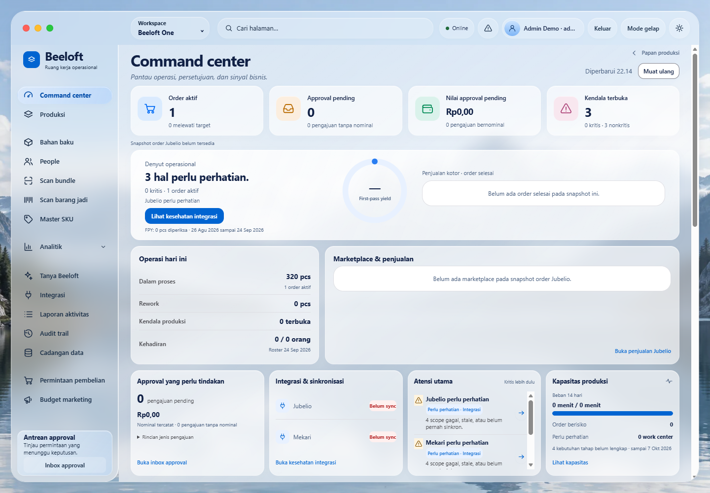
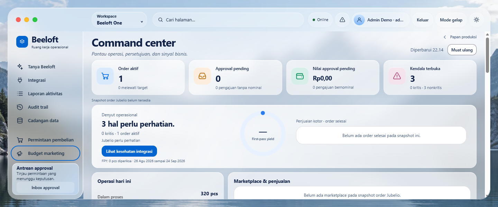
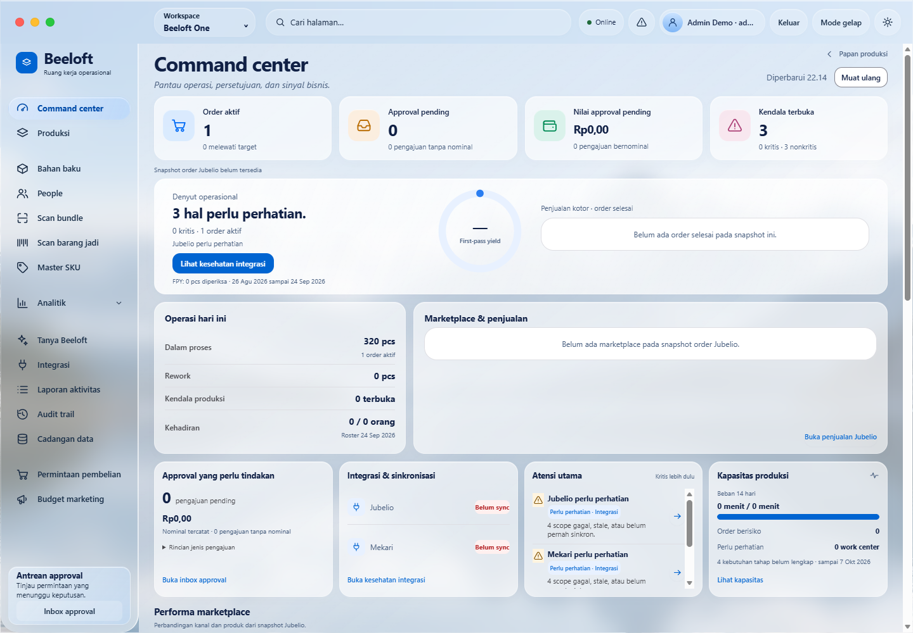
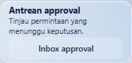

# A5.3 sidebar utility refinement

Based on freshly fetched `origin/main` **48e174a**, the merged A5.3 PR #97.
Working branch: `codex/sidebar-utility-refinement`.
The earlier A5.3 branch used for the before capture has the identical source tree.

The approval utility retains its exact title, supporting sentence and action. Its
decorative inbox mark is removed. Vertical padding is 5px instead of 12px; title
and action gaps are 1px and 2px instead of 4px and 6px. Font sizes are unchanged.
The desktop action is 32px tall instead of 36px, with an 8px corner radius. Narrow
layouts and coarse pointers retain a 44px action target. The subdued translucent
backing keeps the selected navigation lens visually stronger than this card.

The purchasing and marketing destinations retain their original spacing after the
preceding navigation group. The final group's automatic top margin is disabled so
the extra space from the shorter approval card cannot push these destinations down.

## Measurements

CSS pixels, measured in Edge/Chromium with the real app and an isolated demo database.
Light and dark themes have the same dimensions. Supporting copy occupies two lines
on desktop and one line in the expanded 768px menu.

| Viewport | Old card | New card | Reduction | New navigation client height |
| --- | ---: | ---: | ---: | ---: |
| 1440 × 1000 | 124.50 | 92.48 | 25.72% | 715 |
| 1280 × 800 | 124.50 | 92.48 | 25.72% | 515 |
| 1024 × 768 | 124.50 | 92.48 | 25.72% | 491 |
| 768 × 768, menu open | 108.00 | 76.00 | 29.63% | 313 |
| 1440 × 600 | 124.50 | 92.48 | 25.72% | 315 |
| 1024 × 480 | not captured | 92.48 | not compared | 203 |
| 1440 × 1000, maximized/fullscreen | not captured | 92.48 | not compared | 759 |

The 25–35% reduction is met at all four requested widths. The wide tablet menu puts
the action beside the title and supporting sentence, retaining a 44px touch target
without adding vertical height. No text is truncated to obtain these measurements.

## Scroll behavior and regression checks

- PASS: brand, independently scrolling navigation, and pinned footer are separate
  siblings. The navigation flexes into the remaining height; the footer cannot shrink
  or enter its scroll area. Expanded analytics, purchasing, marketing and their focus
  outlines stay above the card at every tested viewport.
- PASS: navigation overflow stays `auto`; its scrollbar is hidden. Mouse wheel,
  keyboard PageDown, tab focus scrolling and an emulated touch swipe work.
- PASS: document overflow is contained. `.workspace-main` owns the visible primary
  vertical scrollbar. The whole sidebar stays at scroll position zero.
- PASS: native fullscreen and the denied-fullscreen maximize fallback retain card
  height. Restoring reproduces the exact original card bounding rectangle.
- PASS: title, copy and action contrast meet 4.5:1 in rendered card samples; minimum
  **5.87:1** in dark mode. Keyboard focus remains visible, and Enter opens the existing
  approval destination. [Rendered contrast samples](screenshots/sidebar-utility/contrast.json).
- PASS: all **69 Apple-27 Python contract checks**, the spring and liquid mapping
  Node checks, browser A2/A3/A5.3 suites, A5.2 workspace suite and the new sidebar
  regression module. The browser runner's initial session/mutation/role checks also
  passed with no JavaScript errors. The full historical business suite was not run.
- PASS: `git diff --check` and JavaScript syntax check.

Only the lens measurement boundary and scroll event wiring change: nested navigation
scrolls synchronize immediately, avoiding a stale frame. The shared node identity,
spring constants/integrator, liquid rendering and fullscreen handlers are unchanged.
Backend, business behavior, authentication, pending-write guards, schema and version
remain unchanged. Version is **0.105.0**. A6 remains unstarted.

Local test logs: `data/sidebar-utility-regression.log`,
`data/sidebar-utility-evidence.log`, and `data/sidebar-utility-touch.log`.
Raw dimensions: [before](screenshots/sidebar-utility/before.json) and
[after](screenshots/sidebar-utility/measurements.json).

## Review screenshots

Normal desktop, 1440 × 1000:

Short viewport, 1440 × 600, expanded navigation scrolled to the last destinations,
with keyboard focus on Budget marketing:

Maximized workspace, 1440 × 1000:

Close crop:

Additional evidence: [native fullscreen](screenshots/sidebar-utility/fullscreen.png),
[dark desktop](screenshots/sidebar-utility/normal-dark.png),
[dark crop](screenshots/sidebar-utility/card-dark.png),
[768px menu](screenshots/sidebar-utility/responsive-768-768.png).

Screenshots use demo data and reduced motion for stable stills. Motion itself was
verified separately by the existing A2/A3/A5.3 browser suites.
